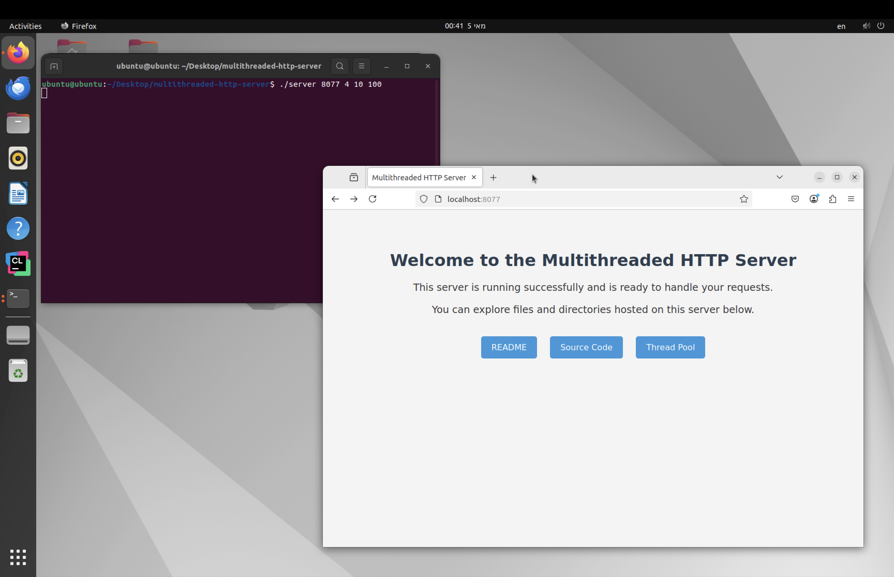

# Multithreaded HTTP Server

A multithreaded HTTP server written in C as part of a Computer Communication Applications course project. The server supports concurrent client requests using a custom thread pool and handles file and directory requests over HTTP.



## Features

* 📡 Handles HTTP GET requests concurrently using threads
* 📂 Serves files and directories with appropriate MIME types
* 🧵 Custom thread pool for efficient task scheduling
* 🛡️ Security checks for file permissions
* 📋 Dynamic directory listing
* 🚫 Error handling with proper HTTP response codes (400, 403, 404, 500)
* 🏠 Includes a custom `index.html` as a default landing page for `/`

## File Structure

```
.
├── server.c          # Main server logic
├── threadpool.c/.h   # Thread pool implementation
├── CMakeLists.txt    # Build configuration for CMake
├── index.html        # Custom landing page
├── Screenshot.png    # Demonstration of landing page
```

## Prerequisites

* Linux-based system with GCC or Clang
* CMake >= 3.10 (optional)
* Basic knowledge of sockets and multithreading

## Build Instructions

### Using CMake (recommended):

```bash
mkdir build
cd build
cmake ..
make
```

### Using gcc directly:

```bash
gcc -o server server.c threadpool.c -lpthread
```

## Run Instructions

```bash
./server <port> <thread_count> <max_queue_size> <max_number_of_requests>
```

Example:

```bash
./server 8080 4 10 100
```

## Testing

### Manual Browser Test

1. Start the server:

   ```bash
   ./server 8080 4 10 100
   ```
2. Open your browser and go to:

   ```
   http://localhost:8080
   ```

   You should see a styled landing page (`index.html`).

### Terminal Tools

* Use `curl`:

  ```bash
  curl http://localhost:8080/index.html
  ```
* Use `telnet`:

  ```bash
  telnet localhost 8080
  GET /index.html HTTP/1.0

  ```

### Simulating File Permission Scenarios

Create a few directories and files to test server behavior under different file access permissions:

```bash
mkdir A B C D

echo "public" > A/file.txt
chmod 644 A/file.txt

echo "private" > B/hidden.txt
chmod 000 B/hidden.txt

echo "read-only" > C/readonly.txt
chmod 444 C/readonly.txt

echo "no-dir-access" > D/noaccess.txt
chmod 700 D
chmod 600 D/noaccess.txt
```

Now try to access those paths from the browser or via `curl`, and validate the returned HTTP status codes are correct (403 for forbidden, 404 if not found, etc.).

```bash
curl http://localhost:8080/B/hidden.txt
```

## Sample Output


[+] Server started on port 8080
[+] Accepted connection
[+] Task queued for worker thread
[+] Request served successfully
```

## Known Issues

* Firewall or port issues may block server access
* Directory listing may fail if permissions are restricted

## Context

This project was developed as part of the "Computer Communication Applications" course at Azrieli College of Engineering. It focuses on hands-on experience in C networking, threading, and systems programming.

## Future Work

* Add support for HTTP POST
* Add SSL/TLS support (HTTPS)
* Optimize thread pool under heavy load
* Extend MIME type support and request logging

## Contact

For questions or feedback, feel free to contact **Noam Azrad** via [GitHub](https://github.com/Noam070)
